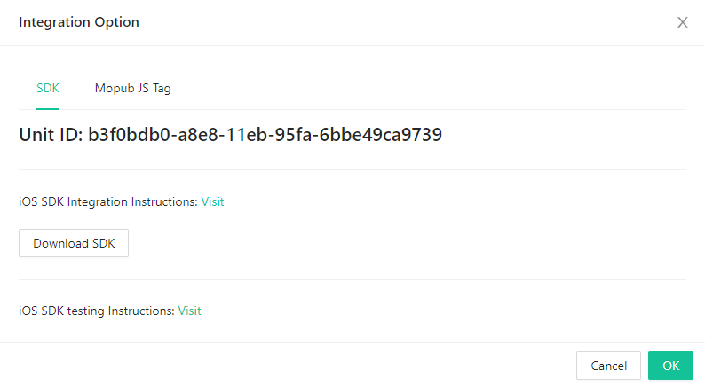

# Get Started with Flat Ads
Welcome to Flat Ads，This article will guide you as you set up your publisher account and monetization with Flat Ads. If you have any questions, please contact your account manager.
### Create a Flat Ads Account
Please contact your account manager to get Flat Ads publisher account.
### Create your app and placement
1. After logging in publisher account，You need to create your app and placement. The more ad units you create, the more varied will be your users’ ad experience, and the better chances you have of higher fill.

2. To Create an app, please input your app info as below.


> Type: whether your traffic is from app or website；
> 
> Platform：Android or IOS；
> 
> Bundle：APP's bundle name；（If your Android APP is on google play, by clicking "Look up" button after you entered bundle name，Store URL and APP Category will be found automatically）
> 
> Store URL：Product link in Google play or apple store；
> 
> Domain：Site's domain；
> 
> Is app published：whether you app is on Google play or apple store；
> 
> Status：if status is inactive，Appid and token will be invalid；
> 
> COPPA：whether your app is directed at users under the age of 13 (COPPA)；
> 
> TOKEN和Appid：Used for integration.
> 

3. Create your placement by clicking save and continue button.


> App/Site：which app/site does this placement belong to. One app/site has more than one placement；
> 
> Name：Name of placement，like "APPNAME_TYPE_SIZE"；
> 
> Bid Floor：Floor bid of this placement. the ads lower than this price will not be showed；(Please start with 0.01$ for test)
> 
> Placement Type：we support Banner, Native, Interstitial and Rewarded Ad；
> 
> Size：Size of placement；
> 
> Allowed Ad Type：Ad type allowed on this placement；we support Display(HTML), Static, VAST Video and Playable；
> 
> Refresh Time：Banner will show another ads if no action occur on the current ads in refresh time.
> 
> Muting：Whether the video is muting or not；
> 
> Allow Skip：How long will an ads be allowed to skip in interstitials placement；
> 
> CTA Popup：Whether a CTA button popups during video ads；
> 
> Status：if status is inactive，placement will not request for ads；
> 

### Integrate the Flat Ads SDK
Now that you’ve set up your app and placement, it’s time to integrate the SDKs into your app.
Flat Ads SDK support Android，IOS，Unity and Cocos。And if integrate Mopub mediation SDK，we also support Mopub JS Tag as an custom network。


### Reporting
Check your numbers in our report.


# Android SDK
### Add Flat ads SDK dependency and Initialize
Dependency

```
dependencies {
    implementation 'com.flatads.sdk:flatads:1.1.11'
}

//

allprojects {
    repositories {
        maven {url "http://maven.flat-ads.com/repository/maven-public/"}
    }
}
```

Initialize SDK
```
public class MainActivity extends AppCompatActivity {

    @Override
    protected void onCreate(@Nullable Bundle savedInstanceState) {
        super.onCreate(savedInstanceState);
        setContentView(R.layout.activity_main);

        String appId = "xxxxxxxx"; //appid in publisher account
        String token = "xxxxxxxxxxxxxxxx"; //token in publisher account

        FlatAdSDK.initialize(getApplication(), appId, token);
    }

}
```

Appid and token should be passed while initializing SDK. It can be found in app/site page in your publisher account.
 


### Placement Type
#### Banner
* To use Banner，BannerAdView need be added in layout
```
# main_activity.xml
    ···
    <com.flatads.sdk.ui.BannerAdView
        android:id="@+id/banner"
        android:layout_width="match_parent"
        android:layout_height="match_parent"
        app:banner_size="small_size"/>
    ···
```
app:banner_size：Please set this attribute with the size to use. We support two banner size：small_size (320x50) and big_size (300x250).big_size (300x250) is default.
"match_parent" need be set for placement in layout. We offer method of "setBannerSize" to operate layout. So it must be implemented in main thread.

In MainActivity，set your Unit ID, then call "loadAd()" to fetch and display the ad:
```
public class MainActivity extends AppCompatActivity {

    @Override
    protected void onCreate(@Nullable Bundle savedInstanceState) {
        super.onCreate(savedInstanceState);
        setContentView(R.layout.activity_main);

        String appId = "xxxxxxxx"; //appid in publisher account
        String token = "xxxxxxxxxxxxxxxx"; //token in publisher account

        FlatAdSDK.initialize(getApplication(), appId, token);

        BannerAdView bannerAdView = findViewById(R.id.banner);
        bannerAdView.setAdUnitId("xxxxxxx");
        bannerAdView.loadAd();
    }

}
```
* To be notified with a variety of ad events callbacks, add "Listener" in relevant "AdView".

1. Ad load Listener
```
        bannerAdView.setAdLoadListener(new AdLoadListener() {
            @Override
            public void onAdSucLoad(AdContent adContent) {
                //ad has successfully loaded
            }

            @Override
            public void onAdFailLoad() {
                //ad failed to load
            }
        });
```
2. Ad impression Listener
```
        bannerAdView.setAdShowListener(new AdShowListener() {
            @Override
            public void onAdShowed() {
                //ad showed
            }

            @Override
            public boolean onAdClicked() {
                return false;  //click intercept; false：will not intercept the following click action; true：will intercept;
            }

            @Override
            public void onAdClosed() {
                //ad closed
            }
        });
```

#### Native
Native layout is customized by publisher, but publisher need call "NativeAdLayout" to operate, while media is loaded by "MediaView". "NativeAdLayout" is FrameLayout。
* Add NativeAdLayout and MediaView in layout

```
# main_activity.xml
<androidx.constraintlayout.widget.ConstraintLayout xmlns:android="http://schemas.android.com/apk/res/android"
    android:layout_width="match_parent"
    android:layout_height="match_parent"
    xmlns:app="http://schemas.android.com/apk/res-auto">
    <FrameLayout
        android:id="@+id/my_content"
        android:layout_width="match_parent"
        android:layout_height="wrap_content"
        app:layout_constraintTop_toTopOf="parent"/>

</androidx.constraintlayout.widget.ConstraintLayout>
```
```
# native_view.xml
<?xml version="1.0" encoding="utf-8"?>
<com.flatads.sdk.ui.NativeAdLayout xmlns:android="http://schemas.android.com/apk/res/android"
    xmlns:app="http://schemas.android.com/apk/res-auto"
    xmlns:tools="http://schemas.android.com/tools"
    android:id="@+id/flat_ad_container"
    android:layout_width="match_parent"
    android:layout_height="300dp"
    android:background="@color/white"
    app:layout_constraintBottom_toBottomOf="parent"
    app:layout_constraintTop_toTopOf="parent">

    <androidx.constraintlayout.widget.ConstraintLayout
        android:layout_width="match_parent"
        android:layout_height="match_parent">

        <com.flatads.sdk.ui.MediaView
            android:id="@+id/flat_ad_media_big"
            android:layout_width="match_parent"
            android:layout_height="0dp"
            app:layout_constraintDimensionRatio="w,9:16"
            app:layout_constraintTop_toTopOf="parent" />

        <ImageView
            android:id="@+id/flat_ad_iv_icon"
            android:layout_width="42dp"
            android:layout_height="42dp"
            android:layout_marginStart="8dp"
            android:layout_marginLeft="8dp"
            android:layout_marginTop="12dp"
            android:layout_marginBottom="12dp"
            app:layout_constraintBottom_toBottomOf="parent"
            app:layout_constraintStart_toStartOf="parent"
            app:layout_constraintTop_toBottomOf="@id/flat_ad_media_big" />

        <TextView
            android:id="@+id/flat_ad_button"
            android:layout_width="0dp"
            android:layout_height="wrap_content"
            android:layout_marginTop="21dp"
            android:layout_marginEnd="12dp"
            android:layout_marginRight="12dp"
            android:layout_marginBottom="21dp"
            android:background="@drawable/shape_bg"
            android:paddingStart="10dp"
            android:paddingEnd="10dp"
            android:paddingTop="5dp"
            android:paddingBottom="5dp"
            app:layout_constraintBottom_toBottomOf="parent"
            app:layout_constraintEnd_toEndOf="parent"
            app:layout_constraintTop_toBottomOf="@id/flat_ad_media_big"
            tools:text="sdasdasdsa"/>

        <TextView
            android:id="@+id/flat_ad_tv_title"
            android:layout_width="0dp"
            android:layout_height="wrap_content"
            android:layout_marginStart="8dp"
            android:layout_marginLeft="8dp"
            android:layout_marginEnd="16dp"
            android:layout_marginRight="16dp"
            android:textColor="@color/text_color"
            android:textSize="14sp"
            android:textStyle="bold"
            app:layout_constraintEnd_toStartOf="@id/flat_ad_button"
            app:layout_constraintStart_toEndOf="@id/flat_ad_iv_icon"
            app:layout_constraintTop_toTopOf="@id/flat_ad_iv_icon" />

        <TextView
            android:id="@+id/flat_ad_tv_desc"
            android:layout_width="0dp"
            android:layout_height="wrap_content"
            android:layout_marginStart="8dp"
            android:layout_marginLeft="8dp"
            android:layout_marginTop="5dp"
            android:layout_marginEnd="16dp"
            android:layout_marginRight="16dp"
            android:textColor="@color/text_des_color"
            android:textSize="12sp"
            app:layout_constraintEnd_toStartOf="@id/flat_ad_button"
            app:layout_constraintStart_toEndOf="@id/flat_ad_iv_icon"
            app:layout_constraintTop_toBottomOf="@id/flat_ad_tv_title" />


    </androidx.constraintlayout.widget.ConstraintLayout>

</com.flatads.sdk.ui.NativeAdLayout>

```
Set ratio of width to height for MediaView.


```
public class MainActivity extends AppCompatActivity {

    private NativeAdLayout adView;
    @Override
    protected void onCreate(@Nullable Bundle savedInstanceState) {
        super.onCreate(savedInstanceState);
        setContentView(R.layout.activity_main);

        String appId = "xxxxxxxx"; //appid in publisher account
        String token = "xxxxxxxxxxxxxxxx"; //token in publisher account

        FlatAdSDK.initialize(getApplication(), appId, token);

        nativeAdView = findViewById(R.id.container);
        String adUnitId = "xxxxxxxxx";

       NativeAd nativeAd = new NativeAd(adUnitId, this);
               AdLoadListener adLoadListener = new AdLoadListener() {
                           @Override
                           public void onAdSucLoad(AdContent adContent) {
                           FrameLayout frameLayout = findViewById(R.id.my_content);
                           adView = (NativeAdLayout) getLayoutInflater().inflate(R.layout.native_big_static,null);
                           adView.setTitle(adView.findViewById(R.id.flat_ad_tv_title));
                           adView.setDescribe(adView.findViewById(R.id.flat_ad_tv_desc));
                           adView.setButton(adView.findViewById(R.id.flat_ad_button));
                           adView.setContainer(adView.findViewById(R.id.flat_ad_container));
                           adView.setMedia(adView.findViewById(R.id.flat_ad_media_big));
                           adView.setIcon(adView.findViewById(R.id.flat_ad_iv_icon));
                               adView.setAdShowListener(new AdShowListener() {
                                   @Override
                                   public void onAdShowed() {

                                   }

                                   @Override
                                   public boolean onAdClicked() {
                                       return false;
                                   }

                                   @Override
                                   public void onAdClosed() {

                                   }
                               });
                               adView.showAd(adContent);
                               frameLayout.removeAllViews();
                               frameLayout.addView(adView);
                           }

                           @Override
                           public void onAdFailLoad() {

                           }
                       };
               nativeAd.setAdListener(adLoadListener);
               nativeAd.loadAd();
    }

    @Override
    protected void onPause() {
        super.onPause();
        if (adView!=null){
            adView.pause();
        }
    }

    @Override
    protected void onResume() {
        super.onResume();
        if (adView!=null){
            adView.resume();
        }
    }


    @Override
    protected void onDestroy() {
        super.onDestroy();
        if (adView!=null){
            adView.destroy();
        }
    }
}
```
Layout element acquisition must be bound when success. Call "showAd" to display ads after layout development, or will get no response.

Because video ads will play in Native, Ads lifecycle callback need be added in relevant Activity lifecycle, or the player may be in error.

* Ad Events
1. Ad load Listener
```
        setAdListener(new AdLoadListener() {
                    @Override
                    public void onAdSucLoad(AdContent adContent) {
                       //ad has loaded successfully
                    }

                    @Override
                    public void onAdFailLoad() {
                        //ad failed to load
                    }
                })
```

2. Impression Listener

```
                    adView.setAdShowListener(new AdShowListener() {
                            @Override
                            public void onAdShowed() {
                                //ad showed
                            }

                            @Override
                            public boolean onAdClicked() {
                                return false; //click intercept; false：will not intercept the following click action; true：will intercept;
                            }

                            @Override
                            public void onAdClosed() {
                                //ad closed
                            }
                        });
```


#### Interstitial

```
public class MainActivity extends AppCompatActivity {

    private InterstitialAd adLoader;
    @Override
    protected void onCreate(@Nullable Bundle savedInstanceState) {
        super.onCreate(savedInstanceState);
        setContentView(R.layout.activity_main);

        String appId = "xxxxxxxx"; // appid in publisher account
        String token = "xxxxxxxxxxxxxxxx"; //token in publisher account

        FlatAdSDK.initialize(getApplication(), appId, token);

        adLoader = new InterstitialAd(this);

        adLoader.setUnitId(adUnitId);
        adLoader.setAdShowListener(new AdShowListener() {
            @Override
            public void onAdShowed() {
                Log.d("INTERSTITIAL","onAdShowed");
            }

            @Override
            public boolean onAdClicked() {
                return false;
            }

            @Override
            public void onAdClosed() {

            }
        });
        adLoader.setAdListener(new AdLoadListener() {
            @Override
            public void onAdSucLoad(AdContent adContent) {
                if (adLoader.isLoaded()){
                    adLoader.showAd(InterstitialLanActivity.this);
                }
            }

            @Override
            public void onAdFailLoad() {

            }
        });
        adLoader.loadAd();
    }

}
```

> Notice：Interstitials need register callback listener and call "showAd" to display ads in "onAdSucLoad". (or trigger "showAd" in own way) When ad request succussfully, isLoaded() is true.

* Ad Events
1. Ad load Listener
```
        setAdListener(new AdLoadListener() {
                    @Override
                    public void onAdSucLoad(AdContent adContent) {
                       //ad has loaded successfully
                    }

                    @Override
                    public void onAdFailLoad() {
                        //ad failed to load
                    }
                })
```

2. Impression Listener

```
        interstitialAdView.setAdShowListener(new AdShowListener() {
            @Override
            public void onAdShowed() {
                //ad showed
            }

            @Override
            public boolean onAdClicked() {
                return false;  //click intercept; false：will not intercept the following click action; true：will intercept;
            }

            @Override
            public void onAdClosed() {
                //ad closed
            }
        });
```

#### Rewarded Video
```
public class RewardedActivity extends AppCompatActivity {

    RewardedAd rewardedAd;

    @Override
    protected void onCreate(@Nullable Bundle savedInstanceState) {
        super.onCreate(savedInstanceState);
        setContentView(R.layout.rewarded_test);
        Map<String, String> map = new HashMap<>();
        map.put("customer_id", "1234567");
        map.put("unique_id", "uihj89uijkbn7uy8");
        map.put("reward_type", "add_coins");
        map.put("reward_value", "2");
        map.put("verifier", "tyuidjkol");
        map.put("extinfo", "{'self define':'xxx'}");
        rewardedAd = new RewardedAd(this);
        rewardedAd.setAdUnitId("d95c3300-bd00-11eb-8f70-6d1821a44678");
        rewardedAd.setRequestParams(map);
        AdLoadListener adLoadCallBack = new AdLoadListener() {
            @Override
            public void onAdSucLoad(AdContent adContent) {
                rewardedAd.showAd(RewardedActivity.this);
            }

            @Override
            public void onAdFailLoad() {

            }
        };
        rewardedAd.setAdListener(adLoadCallBack);
        rewardedAd.loadAd();
        RewardedAdCallback adCallback = new RewardedAdCallback() {
            @Override
            public void onRewardedAdOpened() {

            }

            @Override
            public void onRewardedAdClosed() {

            }

            @Override
            public void onUserEarnedReward() {

            }

            @Override
            public void onRewardedAdFailedToShow() {

            }

            @Override
            public boolean onAdClicked() {
                return false;
            }
        };
        rewardedAd.setRewardedAdCallback(adCallback);


    }

}
```
Pass relevant info of rewarded ads and load ads, then call"showAd" to display ads. (Above is test data)


|  Field Name   | Type  |  example  |  description  |  note  |
|  ----  | ----  | |||
| customer_id  | string |1234567|Motivated clients id|Optional|
| unique_id  | string |uihj89uijkbn7uy8|The only id incentives|Optional|
|  reward_type   | Incentive type|add_coins|The type of incentive|Optional|
|  reward_value  | Incentive value  |2|The value of the incentive|Optional|
| verifier  | Verification code |tyuidjkol|The verification code produced by the access party is used for the verification of the callback chain|Optional|
| extinfo  | Additional information |{"self define":"xxx"}|Access party customization||

* Ad Events
1. Ad load Listener
```
	   AdLoadListener adLoadCallBack = new AdLoadListener() {
            @Override
            public void onAdSucLoad(AdContent adContent) {
                rewardedAd.showAd(RewardedActivity.this);
            }

            @Override
            public void onAdFailLoad() {

            }
        };
```

2. Impression Listener

```jade
		RewardedAdCallback adCallback = new RewardedAdCallback() {
            @Override
            public void onRewardedAdOpened() {
                //rewarded video play
            }

            @Override
            public void onRewardedAdClosed() {
                //close rewarded ads
            }

            @Override
            public void onUserEarnedReward() {
                //earn reward
            }

            @Override
            public void onRewardedAdFailedToShow() {
                //video failed to play
            }

            @Override
            public boolean onAdClicked() {
                return false;
                //click intercept; false：will not intercept the following click action; true：will intercept;
            }
        };
```

### Bidding
SDK support in-app bidding
```
//banner
bannerAdView.bidding(adUnitId, new AdBiddingListener() {
   @Override
   public void getBidding(float price, String token) {

   }
});

//native
NativeAd nativeAd = new NativeAd(adUnitId, this);
nativeAd.bidding(new AdBiddingListener() {
   @Override
   public void getBidding(float price, String token) {

   }
});

//interstitial
interstitialAd = new InterstitialAd(this);
interstitialAd.bidding(adUnitId,new AdBiddingListener() {
   @Override
   public void getBidding(float price, String token) {

   }
})；

//rewarded
RewardedAd rewardedAd = new RewardedAd(this);
rewardedAd.setRequestParams(map);  //map is parameter of rewarded ads
rewardedAd.bidding(adUnitId,new AdBiddingListener() {
   @Override
   public void getBidding(float price, String token) {

   }
});
```
Ads price will be returned after bidding. Developer can decide whether to show this ads by price. If yes, call "winBidding" and pass ad token of win as parameter.

```
//banner
bannerAdView.winBidding(token);

//native
nativeAd.winBidding(token);

//interstitial
interstitialAd.winBidding(token);

//rewarded
rewardedAd.winBidding(token);
```

After bidding succussfully, call "loadAd(token)" to display ads, not call "showAd"
```
//banner
bannerAdView.loadAd(token);

//native
nativeAd.loadAd(token);

//interstitial
interstitialAd.loadAd(token);

//rewarded
rewardedAd.loadAd(token);
```


### What's More

####  Notice
1、Open storage permission of app to download apk from ads when integration, or some phones will not work for downloading apk.
2、When code obfuscation, add -keep class com.flatads.sdk.response.* {*;} , or no data return.
3、Add element in native layout before calling "loadAd" method, or ads will not show properly.
4、Interstitials need register callback listener and call "showAd" to display ads in "onAdLoaded", or ads will not show properly.
5、Network secure config: Create a "xml" folder under "res" folder, then create file "network_security_config.xml"
```
<?xml version="1.0" encoding="utf-8"?>
<network-security-config xmlns:tools="http://schemas.android.com/tools"
    tools:ignore="MissingDefaultResource">
    <base-config cleartextTrafficPermitted="true">
        <trust-anchors>
            <certificates src="system" overridePins="true" />
            <certificates src="user" overridePins="true" />
        </trust-anchors>
    </base-config>
</network-security-config>
```
Next, add the following attributes in application label under file "AndroidManifest.xml"
```

<application
...
 android:networkSecurityConfig="@xml/network_security_config"
...
    />
```


